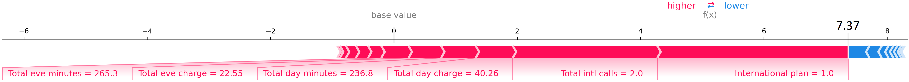
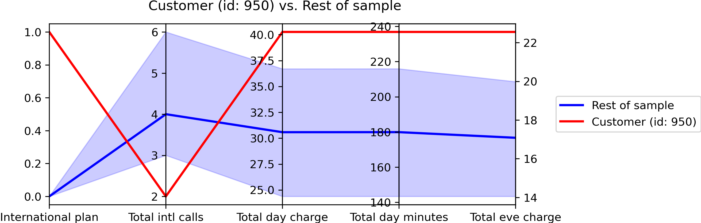

# Bring Explainable-AI to the Next Level by Finding the “Few Vital Causes”

The classical plot used for explainability is the "force plot" from SHAP library:

However this plot contains too much information. 
I believe that it's better to focus on the "few vital" features that make the observation risky. 
This could be done through a parallel plot:

Reference: https://towardsdatascience.com/bring-explainable-ai-to-the-next-level-by-finding-the-few-vital-causes-4838d46857de
